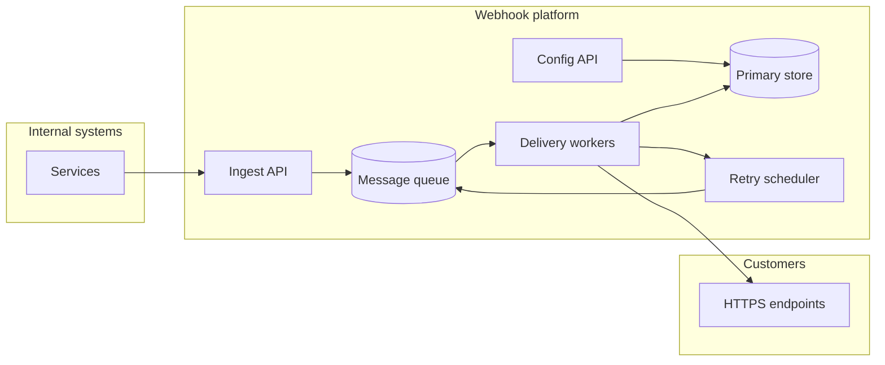
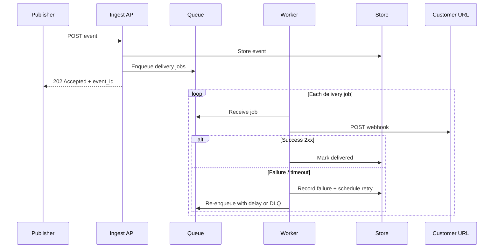

# Webhook delivery platform — system design

This document describes the architecture for reliably delivering internally published events to customer HTTP endpoints, aligned with [requirement.md](./requirement.md).

## 1. Goals

| Requirement | Design response |
|-------------|-----------------|
| Async delivery | Ingest path returns quickly; HTTP calls run out-of-band in workers |
| At-least-once | Durable queue + acknowledgments only after success or terminal failure |
| Idempotent consumer processing | Stable **event ID** (and optional idempotency key) on every delivery attempt |
| Burst scalability | Horizontally scaled workers; back-pressure via queue depth |
| Failure visibility | Per-delivery status, logs, metrics, optional DLQ |
| Safe retries | Exponential backoff, jitter, caps; duplicate deliveries possible by design |

## 2. High-level architecture

- **Ingest API**: Authenticated endpoint for internal services to publish events (event type + payload + metadata).
- **Config API**: Customers manage webhook endpoints, secrets, and event-type subscriptions (CRUD).
- **Message queue**: Buffers work between ingestion and delivery; absorbs bursts and enables retry re-enqueue.
- **Delivery workers**: Pull delivery jobs, perform HTTP POSTs, record outcomes, schedule retries.
- **Primary store**: Durable source of truth for subscriptions, events, and delivery attempts (status queries).
- **Retry scheduler**: Implements backoff (see §6); may be integrated into the queue (delayed messages) or a separate job store.

## 3. Core concepts

### 3.1 Entities

| Entity | Purpose |
|--------|---------|
| **Tenant / customer** | Owns endpoints and subscriptions |
| **Webhook endpoint** | URL, optional signing secret, active flag |
| **Subscription** | Links `(tenant, endpoint, event_type)` — only matching events are delivered |
| **Event** | Immutable record: `event_id`, `event_type`, payload, `occurred_at`, publisher metadata |
| **Delivery** | One row per *(event × endpoint)* attempt chain: status, attempt count, next retry, HTTP details |

Each logical delivery uses a single **`event_id`** (UUID) visible in headers/body so receivers can deduplicate (idempotent processing).

### 3.2 Fan-out

On publish:

1. Persist the event (or idempotent upsert if publishers send a client-supplied idempotency key).
2. Resolve all subscribed endpoints for `event_type` for the relevant tenant(s).
3. Enqueue one **delivery job** per `(event_id, endpoint_id)` (or batch enqueue).

Workers never call customer URLs on the ingest request path.

## 4. End-to-end delivery flow

## 5. APIs (conceptual)

### 5.1 Internal — publish event

- **POST** `/v1/events` (service-to-service auth, e.g. mTLS or signed tokens)
- Body: `event_type`, `payload` (JSON), optional `tenant_id`, optional `idempotency_key` for the publisher
- Response: `202`, `event_id`, optional duplicate flag if idempotency key matches an existing event

### 5.2 Customer — configuration

- CRUD webhook endpoints (URL validation, TLS).
- CRUD subscriptions: `event_type` patterns or explicit list per endpoint.
- Optional: rotate signing secret, test endpoint (“ping”).

### 5.3 Customer / ops — observability

- **GET** `/v1/deliveries/{delivery_id}` — status, attempts, last error, `event_id`
- **GET** `/v1/events/{event_id}/deliveries` — list deliveries for an event
- Filters: time range, status (`pending`, `delivered`, `failed`, `dead_lettered`)

## 6. Retries and “safe” behavior

- **Backoff**: Exponential with **full jitter** between `min` and `max` delay; cap total attempts or time window.
- **Timeouts**: Per-request HTTP timeout; bounded connection pool per worker.
- **Non-retryable errors**: e.g. permanent `4xx` from customer (except 429) may move to **dead letter** after policy evaluation; `429` respects `Retry-After` when present.
- **At-least-once**: Retries can produce **duplicate HTTP requests**; **`event_id`** (and delivery metadata) must be identical across attempts so customers can safely ignore duplicates.

Optional hardening: **content-hash** of payload stored on the event; included in a header for customer verification.

## 7. Webhook HTTP contract

Each POST should include at minimum:

| Mechanism | Purpose |
|-----------|---------|
| Header `X-Webhook-Event-Id: <event_id>` | Idempotency / deduplication |
| Header `X-Webhook-Delivery-Id: <delivery_id>` | Trace a single delivery row |
| Header `X-Webhook-Event-Type: <type>` | Routing without parsing body |
| Optional signature (e.g. HMAC-SHA256 of body + timestamp) | Authenticity |

Body: JSON payload agreed with internal publishers (often wraps `event_id`, `type`, `data`, `occurred_at`).

## 8. Data storage

- **Transactional outbox** (recommended): Write event + outbox rows in one DB transaction; a small **outbox relay** publishes to the queue — avoids “event saved but never queued.”
- **Indexes**: By `event_id`, `delivery_id`, tenant, status, `next_attempt_at` for retry scanners.
- **Retention**: Policy for old events and delivery logs (compliance / cost).

## 9. Observability

- **Metrics**: ingest rate, queue depth, delivery latency, success rate by tenant/endpoint, retry counts, DLQ rate.
- **Tracing**: Trace IDs from ingest through each HTTP attempt.
- **Alerts**: DLQ growth, sustained high failure rate per endpoint, queue age SLO breach.

## 10. Security

- Internal APIs: strong authentication; rate limits per publisher.
- Customer endpoints: TLS-only; optional IP allowlist on customer side.
- Secrets: signing keys encrypted at rest; no secrets in URLs.

## 11. Scaling notes

- **Ingest**: Stateless behind load balancer; scale on RPS.
- **Workers**: Scale on queue lag and CPU; isolate noisy tenants if needed (separate queues or fairness quotas).
- **DB**: Read replicas for status queries; write path sized for event + delivery writes; partition by tenant or time at very large scale.

## 12. Open decisions (to refine in implementation)

- Single multi-tenant vs. dedicated resources for large tenants.
- Exactly-once **ingest** (idempotency key scope) vs. at-least-once publish from clients.
- Push vs. pull from queue; managed cloud offering (SQS, Pub/Sub, RabbitMQ, etc.) vs. self-hosted.
- Whether **synchronous** “test delivery” bypasses the queue (small exception for DX).

---

*This design satisfies the functional requirements in [requirement.md](./requirement.md) and addresses the listed non-functional goals through durable queues, explicit delivery records, retries with jitter, and first-class event/delivery identifiers.*
